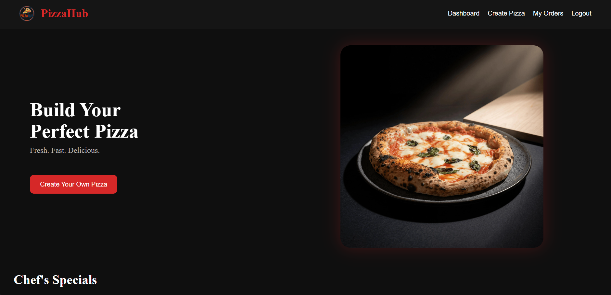
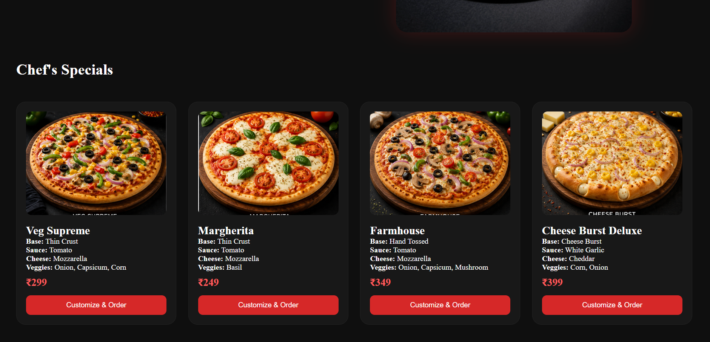
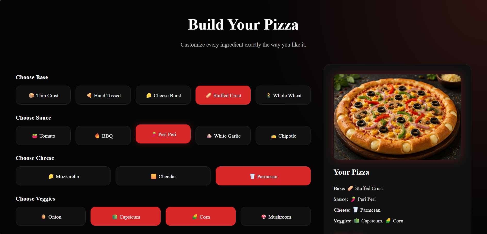
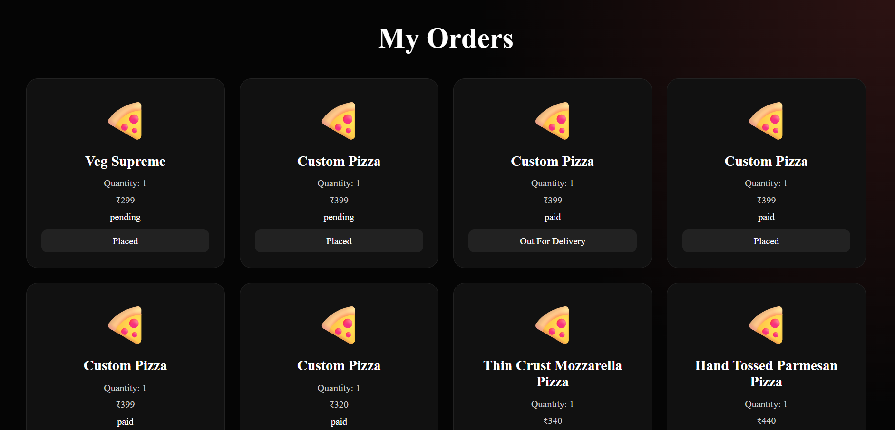
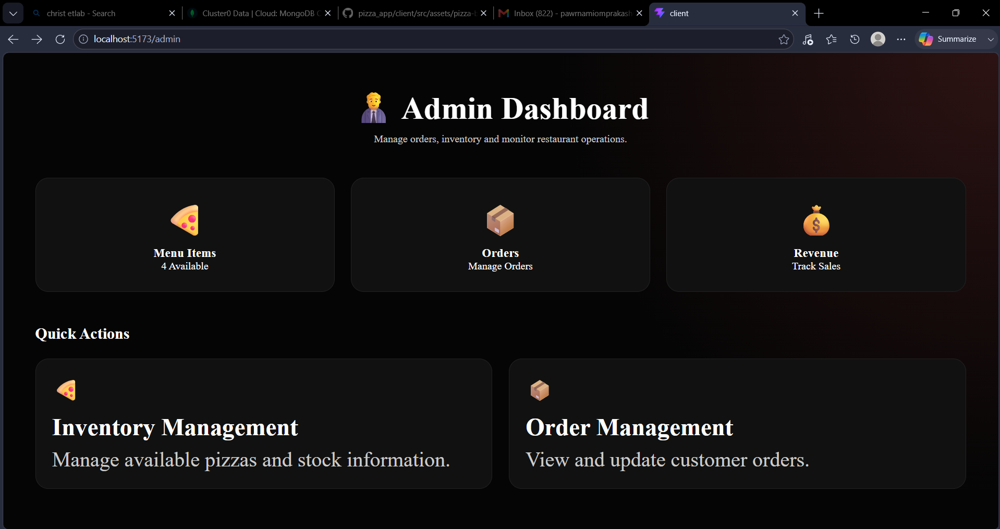
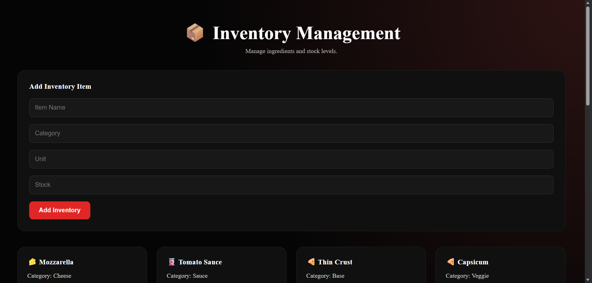
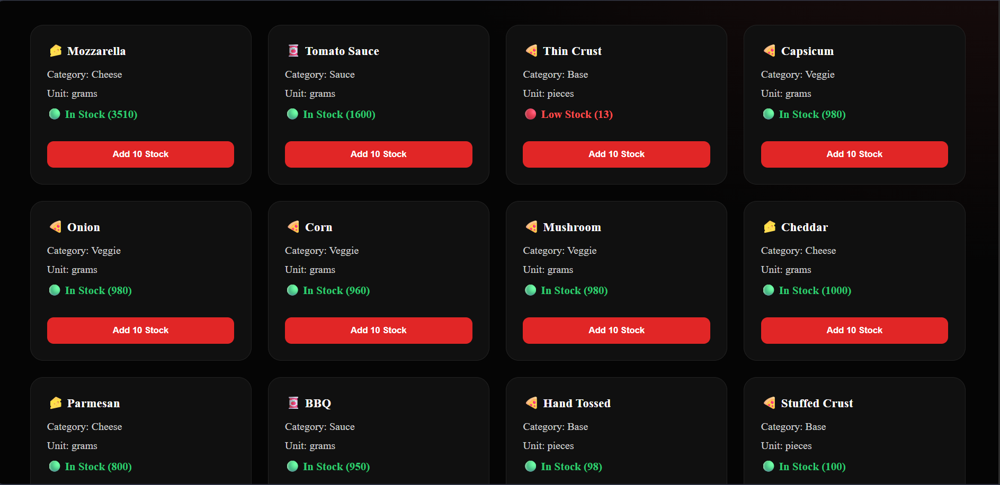
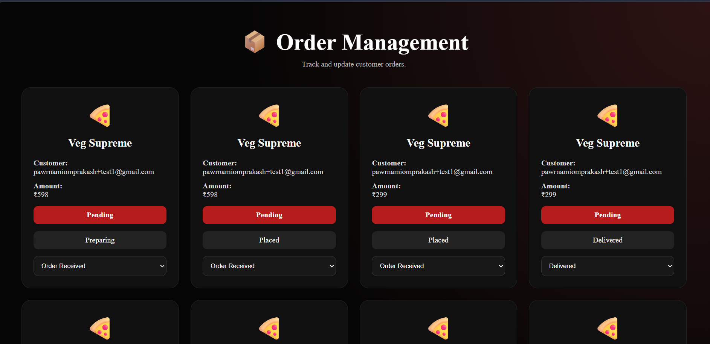

# 🍕 PizzaHub

A full-stack pizza ordering and restaurant management system built using the MERN Stack with Razorpay payment integration.

PizzaHub allows customers to browse pizzas, build custom pizzas, place orders, make payments online, and track their order status. It also includes a complete admin dashboard for inventory and order management.

---

## 🚀 Features

### 👤 Customer Features

- User Registration & Login
- JWT Authentication
- Browse Chef's Special Pizzas
- Build Custom Pizza
- Dynamic Pricing
- Real-time Pizza Preview
- Razorpay Payment Integration
- Order Tracking
- View Order History

### 👨‍💼 Admin Features

- Admin Dashboard
- Inventory Management
- Add New Inventory Items
- Update Stock Levels
- Low Stock Alerts
- Order Management
- Update Order Status
- Monitor Customer Orders

---

## 🛠️ Tech Stack

### Frontend
- React.js
- React Router DOM
- Axios
- CSS

### Backend
- Node.js
- Express.js

### Database
- MongoDB Atlas
- Mongoose

### Authentication
- JWT (JSON Web Token)

### Payment Gateway
- Razorpay

---

## 📸 Screenshots

### Login Page


---

### Customer Dashboard



<br>



---

### Build Your Pizza



---

### My Orders



---

### Admin Dashboard



---

### Inventory Management



<br>



---

### Order Management



---

## ⚙️ Installation

### Clone Repository

```bash
git clone https://github.com/pawrnami2006/pizza_app.git
```

### Navigate to Project

```bash
cd pizza_app
```

### Install Backend Dependencies

```bash
cd server
npm install
```

### Install Frontend Dependencies

```bash
cd ../client
npm install
```

---

## 🔑 Environment Variables

Create a `.env` file inside the server folder and add:

```env
MONGO_URI=your_mongodb_connection_string

JWT_SECRET=your_jwt_secret

RAZORPAY_KEY_ID=your_key_id

RAZORPAY_KEY_SECRET=your_key_secret
```

---

## ▶️ Run Application

### Backend

```bash
cd server
npm start
```

### Frontend

```bash
cd client
npm run dev
```

---

## 📂 Project Modules

### Customer Side

- Authentication
- Dashboard
- Pizza Builder
- Payment Integration
- Order Tracking

### Admin Side

- Inventory Dashboard
- Stock Management
- Order Management
- Delivery Status Updates

---

## 🎯 Future Enhancements

- Sales Analytics Dashboard
- Email Notifications
- Coupon System
- Inventory Auto Deduction
- Mobile Responsive Version
- Admin Revenue Reports

---

## 👩‍💻 Author

**Pawrnami Omprakash**

B.Tech Computer Science Engineering

GitHub:
https://github.com/pawrnami2006

---

⭐ If you like this project, give it a star on GitHub.
